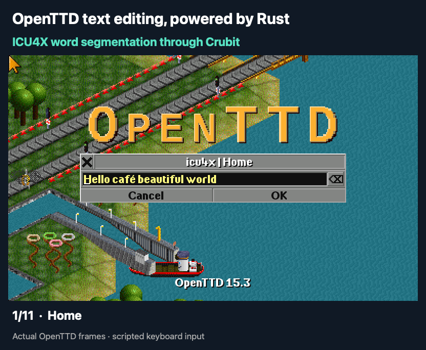

# OpenTTD word navigation through Crubit

This demo replaces OpenTTD's ICU4C word segmentation with ICU4X. A reusable Rust binding supplies the cursor operations the existing C++ consumer expects. Crubit generates the C++ API and Rust ABI thunks. Character/grapheme movement and other ICU operations keep their existing implementation.

## Review the code

1. [Rust binding](word/rust/src/lib.rs): owns the boundaries and cursor state; implements `set_text`, `first`, `following`, `preceding`, `next`, and `previous`.
2. [C++ forwarding shim](word_adapter.cc) and [header](word_adapter.h): convert the input type and call the generated API; no cursor algorithms live here.
3. [OpenTTD integration](../src/string.cpp): selects the backend while preserving existing position mapping and whitespace handling.
4. [Compatibility tests](../src/tests/calif_word_demo.cpp): compare OpenTTD navigation and cursor state with ICU4C.
5. [CMake integration](../CMakeLists.txt): imports the Rust crate through Corrosion and enables Crubit binding generation.

[Detailed API notes and limitations](word/README.md)

The recording-only changes are in `src/misc_gui.cpp` and `src/video/null_v.*`. They drive the real query dialog and capture its framebuffer.

## Watch it



The finished GIF is included in `demo/assets/`. To capture fresh frames, run `python3 demo/record.py` from the checkout root after building and installing the graphics assets below. It writes PPM/PNG frames and a trace under `demo/output/word/icu4x/`, plus `demo/output/word/verification.txt`. These intermediate outputs are ignored by Git. GIF encoding and presentation labels are a separate publishing step.

The GIF shows only the ICU4X Rust backend: 11 scripted text-editing steps in the actual OpenTTD UI, including Ctrl+Left/Right and Ctrl+Delete/Backspace. Labels and margins are added during encoding. The script verifies that all steps were recorded and exercised Rust; compatibility with ICU4C is checked by the automated tests. It is not a performance benchmark.

## Build and run

Validated on macOS arm64 with OpenTTD 15.3 (`14ec60f248547d4d062a1160f0fc26d742319888`), ICU4C 78.3, and ICU4X segmenter 2.2.0 with compiled dictionary data. The original Rust crate's dependencies are pinned in `word/rust/Cargo.lock`; the current Crubit driver resolves dependencies separately for its generated Cargo project.

Crubit source: `20dc640430bd60ff2f7f8dbf69c311c5f807adde`. The local `nightly` toolchain is Rust 1.100.0-nightly (`5a2be9f5f`, 2026-09-06); Crubit needs the matching `rustc-dev` and LLVM tools components. Corrosion's experimental Crubit integration is pinned to `deddd3c0dbf9e6b551d3dd1d6437b8413d41940a` in the same fork used by `google/safe-bindings`. CMake finds a prebuilt driver in the Crubit checkout's `target/release` directory, or Corrosion finds/builds the driver itself. Any driver found on `PATH` must match the selected Crubit source and Rust toolchain.

Use CMake 3.22 or newer. Install OpenTTD's normal build dependencies, plus Abseil and Protobuf for Crubit's CMake support targets. On this Mac these are supplied by Homebrew. Point `CALIF_CRUBIT_SOURCE` at the checkout above; dependency downloads require network access on the first build.

From this OpenTTD checkout:

```sh
cmake -S . -B build -DCMAKE_BUILD_TYPE=RelWithDebInfo \
  -DCALIF_ICU4X_DEMO=ON -DCALIF_CRUBIT_SOURCE=/absolute/path/to/crubit \
  -DICU_ROOT=/opt/homebrew/opt/icu4c -DCMAKE_PREFIX_PATH=/opt/homebrew/opt/icu4c \
  -DOPTION_USE_ASSERTS=ON -DOPTION_USE_LTO=OFF
cmake --build build --target openttd openttd_test -j 6
build/openttd_test '[word]'
build/openttd_test
python3 demo/record.py
```

The CMake option defaults off. Enabling it selects OpenTTD's ICU implementation on this Mac so the baseline uses ICU4C rather than Cocoa text iteration. `CALIF_WORD_BACKEND=icu4x` enables the Rust word cursor; the default is `icu4c`.

Recording requires OpenGFX 8.0 at `build/baseset/opengfx-8.0.tar` and uses macOS `sips` to convert frames to PNG. Downloaded graphics archive SHA-256: `43a0c1dabf39cb865394f3a6cc36d4da5c10ecfaaf55652043104806810903be`. The script uses isolated configurations, disables the survey and sound, and writes only local files under `output/word/`.

For an interactive run after recording creates the configurations:

```sh
cd build
CALIF_WORD_BACKEND=icu4x ./openttd -X -x \
  -c ../demo/output/word/icu4x/openttd.cfg -s null -m null -I OpenGFX
```

The offscreen recording is verified; interactive Cocoa UI behavior and Linux/Windows builds have not been verified.

## Continuous integration

The [ICU4X workflow](../.github/workflows/ci-icu4x.yml) builds the demo on macOS arm64 with Xcode 26.3 and `nightly-2026-09-07`. It builds the pinned Crubit Cargo driver from source, enables `CALIF_ICU4X_DEMO`, builds the application, and runs the word-navigation comparisons and full unit suite. The inherited platform jobs leave the demo disabled; their results do not establish Crubit support on those platforms.

The fork's shared vcpkg setup uses a file cache without organization package credentials. It downloads libdisasm from Debian's source mirror and verifies the original vcpkg SHA-512 checksum. Windows CI uses the VS 2022 runner because the 15.3 dependency baseline's Breakpad code uses an API removed in VS 2026. These CI changes leave the OpenTTD source baseline and manifest dependency versions intact.

## Binding generation through Corrosion

After loading Corrosion, the binding integration is:

```cmake
corrosion_experimental_crubit(icu4x_word_bindings)
corrosion_import_crate(MANIFEST_PATH demo/word/rust/Cargo.toml LOCKED)
target_link_libraries(calif_word_adapter PRIVATE icu4x_word_bindings)
```

Corrosion invokes Crubit's Cargo driver and exposes the generated header directory, static library, and Crubit support targets. Our CMake integration also adds an explicit build-order dependency from the aggregate `crubit_support` target to its member libraries. With the tested versions, linking the aggregate alone listed the archives but did not build them before the application link:

```cmake
get_target_property(_calif_support_targets crubit_support INTERFACE_LINK_LIBRARIES)
add_dependencies(crubit_support ${_calif_support_targets})
```

No Python script is needed to build the bindings. Python is used only for the optional UI recording. The C++ forwarding shim is built without exceptions.

The generated header is `build/corrosion_generated/crubit/icu4x_word_bindings/include/crubit/icu4x_word_bindings.h`; the imported archive is `build/libicu4x_word_bindings.a`.

ICU4X's default features stay enabled in `Cargo.toml`. The pinned driver adds direct dependencies with defaults enabled to its generated Cargo project. Disabling defaults only in our original project made the two builds disagree on ICU4X type layouts, and Crubit's generated size assertions correctly rejected the build. Keeping defaults enabled lets the standard Corrosion build complete. It adds the optional `core_maths` and `libm` dependencies; the binding still explicitly calls `WordSegmenter::new_dictionary()`. Binary size and performance effects have not been measured. A future driver fix that preserves dependency features would let us revisit disabling defaults.

`LOCKED` protects the original crate's dependency resolution; this version of the driver does not forward it or the original lockfile to its secondary Cargo build. The recorded successful build therefore is not a claim of fully locked transitive dependencies across both stages.

Generated bindings, build outputs, and raw recording files are ignored by Git. Only the finished demo GIF in `demo/assets/` is committed.

## Validation

The word tests passed **22,915 assertions**, covering 270 input strings through OpenTTD plus direct cursor state checks. The full suite passed **97 test cases / 25,093 assertions**. Before simplifying the animation to show only Rust, the original recording also matched ICU4C for **11/11 text/cursor states**. To save fresh test logs locally:

```sh
mkdir -p demo/output/word
build/openttd_test '[word]' > demo/output/word/differential-tests.txt
build/openttd_test > demo/output/all-tests.txt
```

The recording script writes its frame-count and Rust-backend checks to `demo/output/word/verification.txt`.

These checks were rerun after replacing the Python binding build with Corrosion, using the tool versions listed above. Validation reused the cached Corrosion source at the pinned commit via `FETCHCONTENT_SOURCE_DIR_CORROSION` and the matching prebuilt Crubit driver. A first-time automatic installation of the driver was not tested. No Crubit or Corrosion source patches were needed.

Compatibility checks cover the tested inputs and call patterns. Performance parity, coverage-guided fuzzing, and sanitizer coverage remain unverified. The input conversion, boundary storage, and per-operation Crubit calls need to be included in future measurements.

OpenTTD and these modifications use the repository's GPLv2 license. Preserve OpenGFX's accompanying license and attribution when redistributing assets. Rust dependencies and Crubit retain their respective licenses. This is an independent prototype.
